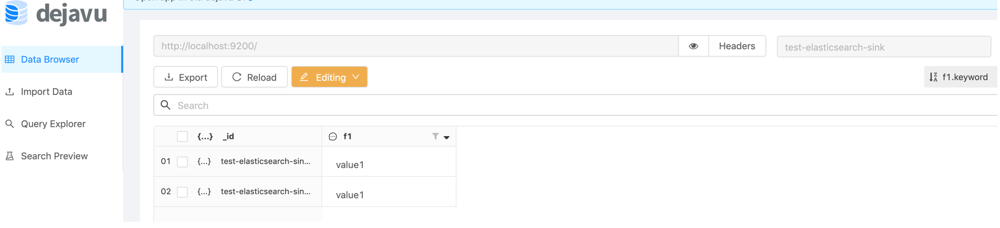

#Connector

##Lab: Elastic search sink connector

###Install elastic search


```sh
docker run -p 9200:9200 -p 9300:9300 -e "discovery.type=single-node" docker.elastic.co/elasticsearch/elasticsearch:7.5.0
```

###Install connector

```sh
$ confluent-hub install confluentinc/kafka-connect-elasticsearch:5.3.1

$ confluent list connectors //  make sure you can see this connector i.e. elasticsearch-sink

$ confluent load elasticsearch-sink // see the connector properties
```


output 
```json
{
  "name": "elasticsearch-sink",
  "config": {
    "connector.class": "io.confluent.connect.elasticsearch.ElasticsearchSinkConnector",
    "tasks.max": "1",
    "topics": "test-elasticsearch-sink",
    "key.ignore": "true",
    "connection.url": "http://localhost:9200",
    "type.name": "kafka-connect",
    "name": "elasticsearch-sink"
  },
  "tasks": [],
  "type": null
}
```

You can install connector at below rest endpoint


POST: http://localhost:8083/connectors

Or run locally
```sh
./connect-standalone ../etc/schema-registry/connect-avro-standalone.properties ../etc/kafka-connect-elasticsearch/quickstart-elasticsearch.properties
```

Produce some records

```sh
./kafka-avro-console-producer --broker-list localhost:9092 --topic test-elasticsearch-sink --property value.schema='{"type":"record","name":"myrecord","fields":[{"name":"f1","type":"string"}]}'

```

Sample:

```json
{"f1": "value1"}
```


browse

http://localhost:9200/test-elasticsearch-sink/_search?pretty
or install this chrome add-on for UI


